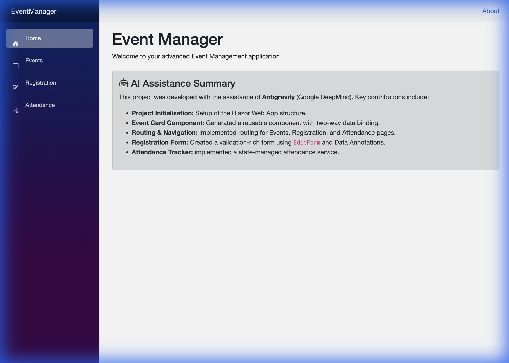

# Event Manager Blazor App

A comprehensive Event Management application built with Blazor Web App (.NET 10.0), featuring event listings, registration, and attendance tracking.



## Features

- **Event Cards**: Interactive components with two-way data binding.
- **Routing**: Navigation between Home, Events, Registration, and Attendance pages.
- **Registration Form**: Validated form using `EditForm` and Data Annotations.
- **Attendance Tracker**: State-managed attendance tracking using a scoped/singleton service.
- **AI-Assisted Development**: Built with the help of Antigravity (Google DeepMind).

## How to Run

1. Ensure you have the .NET 10.0 SDK installed.
2. Navigate to the `EventManager` project folder:
   ```bash
   cd EventManager
   ```
3. Run the application:
   ```bash
   dotnet run
   ```
4. Open the browser to the URL shown in the terminal (e.g., `http://localhost:5014`).
